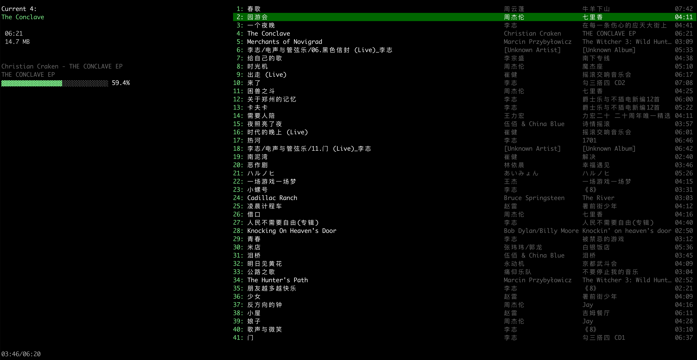

# NaviCLI 🎵
[](https://golang.org/)
[](https://github.com/yhkl-dev/NaviCLI/releases)
[](LICENSE)

A lightweight command line music player for Navidrome, written in Go.


## Background
> I found that Feishin client is very slow on MacOS.
> To be honest, we don't need a GUI for listening to music.
> So I built this app to play Navidrome music from terminal.
> Hope you guys like it.

## Features

- 🚀 Fast and lightweight
- 🎨 Terminal-based UI with colors
- ⏯ Play/pause/skip controls
- 🔍 Basic music library browsing
- 🛠 Written in pure Go

## Installation

### Prerequisites
```bash
brew install mpv

export C_INCLUDE_PATH=/opt/homebrew/include:$C_INCLUDE_PATH
export LIBRARY_PATH=/opt/homebrew/lib:$LIBRARY_PATH
```

### Install from Release (Recommended)
Download the latest pre-built binary from [Releases](https://github.com/yhkl-dev/NaviCLI/releases):

```bash
curl -L https://github.com/yhkl-dev/NaviCLI/releases/latest/download/navicli-darwin-amd64 -o navicli
chmod +x navicli
sudo mv navicli /usr/local/bin/
```

### Install from Source (Go 1.16+ required)
```bash
go install github.com/yhkl-dev/NaviCLI@latest
```

### Configuration
Create a config file at `~/.config/config.toml`:
```toml
[server]
url = "https://your-navidrome-server.com"
username = "your-username"
password = "your-password"
```

## Usage
```bash
navicli
```

Key bindings:
- `Space`: Play/Pause
- `n`/`→`: Next track
- `p`/`←`: Previous track
- `ESC`: Quit

## Development
```bash
# Build
go build -o navicli .

# Run tests
go test ./...
```

## Roadmap
- [ ] Publish to Homebrew
- [ ] Add search function
- [ ] Add Lyrics support
- [ ] Add refresh function
- [ ] Add playlist support
- [ ] Cross-platform builds (Linux/Windows)

## Contributing
PRs are welcome! Please open an issue first to discuss what you'd like to change.

## License
[MIT](LICENSE)
```
